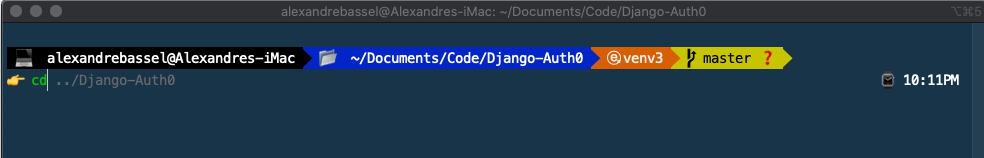
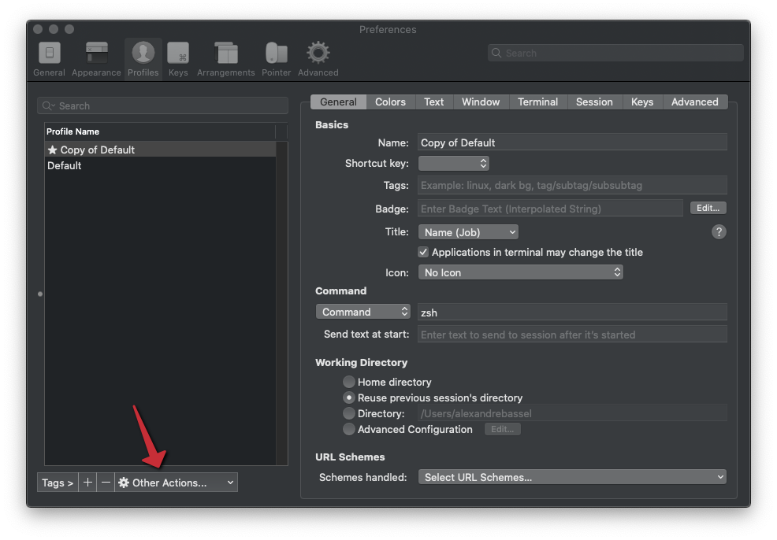

# Customizing your ZSH prompt in OSX Catalina

Created: 2020-01-10

Imagine having better autocomplete and a more informative prompt that could save you significant amount of time!
Development workflows run on top of a prompt and are an important part of good software engineering. 

In this article, I will share my scripts and show some of the benefits of taking the time to polish your prompt!



## Steps for Mac:

All the steps below except for the LAST TWO, can be executed with a simple script below:

```bash
wget https://gist.github.com/abassel/7b4e6e09916c46d24efb/raw/up_iconic.sh
chmod +x up_iconic.sh
./up_iconic.sh
```

1. Install Iterm2 from http://iterm2.com or ( `brew install iterm2` )
   
2. Install zsh-autosuggestions zsh-syntax-highlighting zsh-completions and wget( `brew install zsh-autosuggestions zsh-syntax-highlighting zsh-completions wget` )

3. Install oh-my-zsh from `http://ohmyz.sh` or
`sh -c “$(curl -fsSL https://raw.github.com/ohmyzsh/ohmyzsh/master/tools/install.sh)”
sudo chown -R $(whoami) ~/.oh-my-zsh`
4. Download the custom theme:
`wget https://gist.github.com/abassel/49cb51657e3d7713e4fb/raw/iconic.zsh-theme -O ~/.oh-my-zsh/themes/iconic.zsh-theme`
5. Download the custom .zshrc. This file is pre-configured to use the iconic theme(ZSH_THEME=”iconic”)
`wget https://gist.githubusercontent.com/abassel/cea311f65fda959c530d/raw/.zshrc -O ~/.zshrc`
6. Download iterm configuration:
`wget https://gist.githubusercontent.com/abassel/80379df8eeaffb33cd9ccb6010abf690/raw/iterm2.config.jso`
7. Open ITerm2 and load the configuration file. **Select iTerm2 > Preferences > Profiles > Other Actions…. > Import JSON Profile**. After loading config, set it to default.



8. Restart iTerm2.

[filename](footnote.md ':include')
